<div align="center">

# ```text
███████╗ █████╗ ███████╗██╗██████╗ ███████╗██╗   ██╗███████╗██╗      ██████╗ ██████╗ ███████╗██████╗
██╔════╝██╔══██╗╚══███╔╝██║██╔══██╗██╔════╝██║   ██║██╔════╝██║     ██╔═══██╗██╔══██╗██╔════╝██╔══██╗
███████╗███████║  ███╔╝ ██║██║  ██║█████╗  ██║   ██║█████╗  ██║     ██║   ██║██████╔╝█████╗  ██████╔╝
╚════██║██╔══██║ ███╔╝  ██║██║  ██║██╔══╝  ╚██╗ ██╔╝██╔══╝  ██║     ██║   ██║██╔══██╗██╔══╝  ██╔══██╗
███████║██║  ██║███████╗██║██████╔╝███████╗ ╚████╔╝ ███████╗███████╗╚██████╔╝██║  ██║███████╗██║  ██║
╚══════╝╚═╝  ╚═╝╚══════╝╚═╝╚═════╝ ╚══════╝  ╚═══╝  ╚══════╝╚══════╝ ╚═════╝ ╚═╝  ╚═╝╚══════╝╚═╝  ╚═╝

### AI-Powered Full-Stack Software Engineer

Building scalable web applications and intelligent software with TypeScript, React, Next.js, Node.js, PostgreSQL, AI Agents, RAG, Cloud & DevOps.

<a href="https://saziddeveloper.github.io/">
  
</a>
<a href="https://github.com/saziddeveloper">
  
</a>

</div>

---

## `01 // Pofile Info`

<table>
<tr>
<td width="42%" align="center">



</td>

<td width="58%" align="center">



</td>
</tr>
</table>

---

## `02 // CONTRIBUTION MATRIX`

<div align="center">



</div>

---

## `03 // ABOUT ME`

I'm **Ashaduzzaman Sazid**, a Full-Stack Developer focused on building practical, responsive, and production-oriented web applications.

I work across the full development cycle — from crafting modern interfaces with React, Next.js, TypeScript, and Tailwind CSS to building backend systems and APIs with Node.js, Express.js, and database technologies such as MongoDB and PostgreSQL.

I'm continuously expanding into AI Engineering, exploring LLMs, RAG, AI Agents, embeddings, and intelligent application workflows while strengthening my foundations in software architecture, testing, cloud, and DevOps.

My goal is to build software that isn't just functional, but scalable, maintainable, intelligent, and genuinely useful — growing toward becoming an AI-Powered Full-Stack Software Engineer.

---

## `04 // TECH ARSENAL`

### Frontend
<p>
  
</p>

### Backend
<p>
  
</p>

### Database
<p>
  
</p>

### DevOps & Cloud
<p>
  
</p>

### Tools
<p>
  
</p>

---

## `05 // FEATURED PROJECTS`

<table>
<tr>

<td width="50%" valign="top">

### Banking System

A JavaScript-based banking system project demonstrating frontend logic, user interactions and multi-page web development.

**Stack:** JavaScript · HTML · CSS

<a href="https://github.com/saziddeveloper/SIMPLE-BANKING-SYSTEM">
View Repository →
</a>

</td>

<td width="50%" valign="top">

### G3 Architects

A responsive architecture company website focused on clean layout, visual presentation and responsive web design.

**Stack:** HTML · CSS

<a href="https://github.com/saziddeveloper/G3-ARCHITECTS">
View Repository →
</a>

</td>

</tr>

<tr>

<td width="50%" valign="top">

### Flower Shop

A flower-shop website project focused on frontend layout, styling and responsive web presentation.

**Stack:** HTML · CSS

<a href="https://github.com/saziddeveloper/FLOWER-SHOP">
View Repository →
</a>

</td>

<td width="50%" valign="top">

### More Projects

I maintain additional projects covering web development, frontend experiments and programming practice.

<a href="https://github.com/saziddeveloper?tab=repositories">
Explore All Repositories →
</a>

</td>

</tr>
</table>

---

## `06 // CURRENTLY`

| Area        | Focus                                               |
| ----------- | --------------------------------------------------- |
| `BUILDING`  | Full-stack web applications & SaaS products         |
| `LEARNING`  | TypeScript • Next.js • PostgreSQL • System Design   |
| `EXPLORING` | AI Engineering • LLMs • RAG • AI Agents             |
| `DEPLOYING` | Vercel • Docker • GitHub Actions • Cloud            |
| `IMPROVING` | Software Architecture • Testing • Security          |
| `GOAL`      | Becoming an AI-Powered Full-Stack Software Engineer |

---


---


---

## `07 // CONNECT`

<div align="center">

<p> <a href="https://github.com/saziddeveloper">  </a> <a href="https://www.linkedin.com/in/saziddeveloper/">  </a> <a href="https://www.facebook.com/saziddeveloper/">  </a> </p>

<p> <a href="mailto:saziddeveloper@gmail.com">  </a> <a href="https://saziddeveloper.github.io/">  </a> </p>

<br>

<sub><code>OPEN TO BUILD • COLLABORATE • CREATE</code></sub>

</div>

---

<div align="center">

### `BUILD • BREAK • LEARN • REBUILD`


</div>
